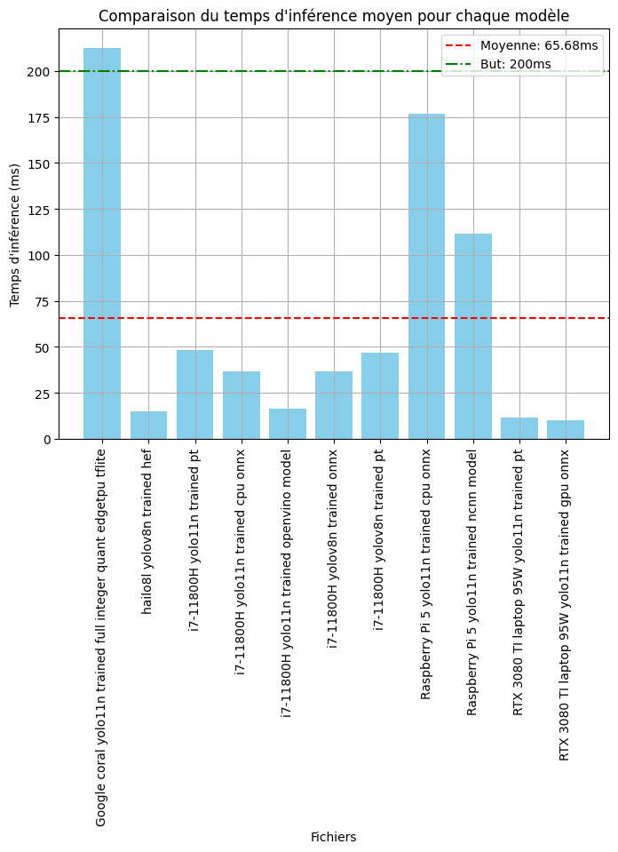
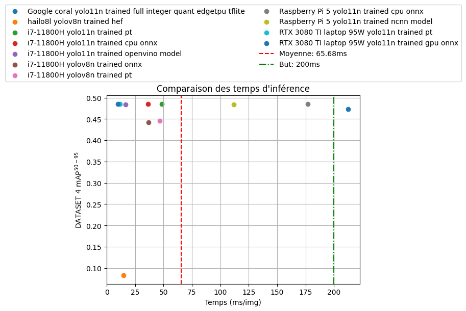

# YOLO

@Author Colin de Seroux

## Version

yolov8n / yolo11n (je suis obligé de prendre la v8n pour hailo)

## Entrainement des modèles

[Par ici, par ici, venez, n'ayez pas peur.](./fine-tuning.ipynb)

## Exportation des modèles

[Par ici, par ici, venez, n'ayez pas peur.](./export.ipynb)

## Test des modèles

[Par ici, par ici, venez, n'ayez pas peur.](./test.ipynb)

## Résultats

Comme nous pouvons le voir en mode embarqué ce qui est le plus éfficace est Hailo 8L.

Mais il y a une perte de précision liée au fait que l'optimisation en .har n'a pas pu être faite.

## Sources

### Sur raspberry pi

- https://docs.ultralytics.com/fr/guides/raspberry-pi/#use-ncnn-on-raspberry-pi
- https://docs.ultralytics.com/fr/guides/raspberry-pi/#use-raspberry-pi-camera

### Sur hailo

- https://github.com/hailo-ai/hailo_model_zoo/blob/master/training/yolov8/README.rst

### Sur Google Coral

- https://docs.ultralytics.com/fr/guides/coral-edge-tpu-on-raspberry-pi/#what-should-i-do-if-tensorflow-is-already-installed-on-my-raspberry-pi-but-i-want-to-use-tflite-runtime-instead
- https://coral.ai/docs/accelerator/get-started/#runtime-on-linux

### Sur NVIDIA Jetson

- https://docs.ultralytics.com/fr/guides/nvidia-jetson/#nvidia-jetson-series-comparison
- https://www.jetson-ai-lab.com/tutorial_ultralytics.html
